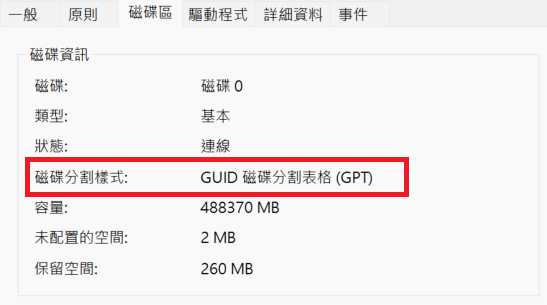
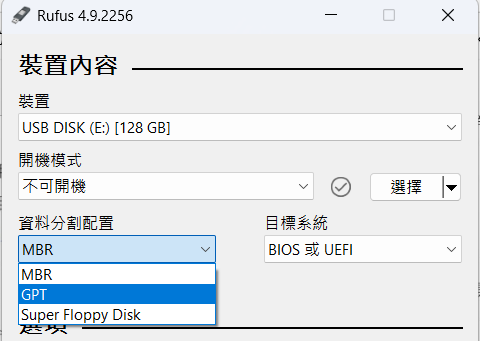

+++
title = '在 Raspberry Pi 5 安裝 Ubuntu Desktop，並用 SSH 遠端控制'
date = '2025-08-04T08:51:38+08:00'
lastmod = '2025-08-22T07:13:00+08:00'
draft = false
categories = ['樹莓派']
tags = ['樹莓派', 'ssh']
+++

# 在 Raspberry Pi 5 安裝 Ubuntu Desktop，並用 SSH 遠端控制

## 參考影片和文章
- [2025更新版 - Raspberry Pi #22集 - 無痛安裝，免買鍵盤螢幕！(中文字幕)](https://www.youtube.com/watch?v=Vl2B2Zcxai0&list=PLFzg1I0R-W6yWjVEBhYtfYvoNB8iz2-xx)
- [[Raspberry Pi]如何用VNC遠端控制樹莓派(Ubuntu desktop 23.04)?](https://blog.csdn.net/weixin_42008031/article/details/132378792)
- [（树莓派Raspberry Pi 5系列文章）一、安装ubuntu24.04操作系统](https://blog.csdn.net/guojingyue123/article/details/135914906)
- [RPi 5 is a real primadonna with its PSU requirements for USB booting](https://www.reddit.com/r/raspberry_pi/comments/17ua49o/rpi_5_is_a_real_primadonna_with_its_psu/)
- [[樹莓派 5] 使用 VS Code 遠端開發 Python 程式](https://tedliou.com/raspberrypi/vscode-remote-development/)
- [树莓派5 调速风扇，主动散热器调速控制](https://blog.csdn.net/aimeige/article/details/143043553)
- [Raspberry Pi學習筆記（三）：指令與功能](https://gradient-drift.medium.com/raspberry-pi%E5%AD%B8%E7%BF%92%E7%AD%86%E8%A8%98-%E4%B8%89-%E6%8C%87%E4%BB%A4%E8%88%87%E5%8A%9F%E8%83%BD-b9e1a7a6a14)


## 0. 安裝前注意事項
* 請使用官方電源！！！不然你高機率動不起來，或是動到一半就突然關機。
* 製作開機隨身碟時，請確認隨身碟的**磁碟分割樣式**為 GPT，而不是MBR，用 MBR 的話會導致安裝時出現錯誤，詳情請見這個影片：[Windows 11 安装 Ubuntu 22.04 双系统步骤和注意事项](https://youtu.be/szlNPdAt3Kk?si=Ek3xTJiH0HBedR5d&t=152)。
* 磁碟分割樣式的查看方式（Window11）為：電腦管理 > 磁碟管理 > 右鍵磁碟X (隨身碟所在磁碟) > 內容 > 磁碟區。

* 如果是 MBR 的話，請把他換成 GPT，這部分可以使用經典的 [Rufus](https://rufus.ie/zh_TW/) 燒錄軟體來更改成 MBR，如下圖。



## 1. 下載 Raspberry Pi Imager
先到樹莓派官網的[軟體頁面](https://www.raspberrypi.com/software/)，下載 Raspberry Pi Imager，這個軟體可以協助我們燒錄 Bootloader 和 OS 到 USB 或 SD 卡裡面。


## 2. 燒錄 Bootloader 到 SD 卡
1. 先選擇 Raspberry Pi 5
    
2. 選擇操作系統
    1. 往下拉選擇 Misc utility images
        
    2. 選擇 Bootloader (Pi 5 family)
        
    3. 選擇 NVMe/USB Boot。這個選項的意思是優先從 NVMe 開機，沒有的話則嘗試 USB，最後才嘗試 SD 卡。因為之後會使用 USB 來自製作開機碟，所以這個選項最適合我們。
        
3. 選擇要燒入的設備 (這邊是使用 SD 卡)
    
4. 設定好後，點擊 **下一步** 來燒把 Bootloader 燒錄到 SD 卡裡面。你可能會遇到防火牆阻擋 Raspberry Pi Imager 寫入 SD 卡，記得允許再從執行就好。
5. 把燒錄完成的 SD 卡插入到樹莓派的 SD 卡插槽，然後開啟電源，如果看到電源附近附近的燈號恆亮綠燈，那就是已經把 Bootloader 寫好了。此時就可以樹莓派的電源關掉，然後取出 SD 卡，因為它只是用來載入 Bootloader。


## 3. 燒錄 OS 到 USB 裡面
1. 樹莓派一樣選擇 Raspberry Pi 5。
2. 選擇操作系統 Ubuntu Desktop 24.04.02 LTS，你也可以使用自定義的鏡像。
3. 選擇要燒入的設備，然後點擊下一步，會被問是否要定義系統配置，這邊可以略過，因為進入 Ubuntu Desktop 時都要重新設定。

4. 確認後就開始燒錄，這過程會蠻久的。


## 4. 插入 USB 到樹莓派
燒錄完成後，把 USB 從電腦拔出，然後插入到樹莓派的 USB 3 插槽，然後開啟電源啟動樹莓派。需要等待一段時間讓它安裝。

再過一段時間後，就會進到設定語言、鍵盤、使用者等資訊，這部分在網路上已有很多介紹，所以就不贅述了。


## 5. 安裝 OpenSSH Client (你的電腦)
1. 在自己的筆電或桌機上，開啟設定 > 系統 > 選用功能 > 檢視功能 > 安裝 OpenSSH 用戶端。
2. 打開 CMD，輸入 `ssh`，看有沒有跑出提示，有的話就是安裝成功。


## 6. 安裝 OpenSSH Server (樹莓派上的 Ubuntu)
開啟 Ubuntu 的 shell，輸入以下命令來安裝 OpenSSH 的 Server 端，以讓我們的 Client 端可以透過 ssh 來連線。
```bash
sudo apt update
sudo apt install openssh-server -y
```
安裝完後可以使用以下命令查看有沒有人連過來
```bash
sudo systemctl status ssh
```


## 使用 SSH 登入樹莓派主機
:::info
確保樹莓派和你的電腦連接到同一 Wi-Fi 或 LAN 網路。
:::
:::info
[[機派X] Day 3 - Bash 是啥東東](https://ithelp.ithome.com.tw/articles/10263811)
* 在 Linux 中，我們將它的命令列界面（CLI）稱為 Shell，正如同前面提到的，CLI（也就是 Shell）是我們與 Ubuntu 互動的橋樑，只要在 Shell 中輸入指令就可以操作電腦。
* 其實 Shell 還分很多種。Ubuntu 內建且預設使用的 Shell 就是 Bash。
:::
1. 在 shell 輸入以下命令
    ```bash
    # ssh <username>@<rpi_HostIP>
    ssh ubuntu@192.168.115.46
    ```
    * username 是你設定的使用者名稱。
    * rpi_HostIP 是樹莓派在當前網路下的 IP，可以透過 `hostname -I` 命令來查詢。
2. 登入後會問要不要建立 Key，以及輸入密碼。確認無誤後，就可以進入到 Ubuntu 的 Bash。

